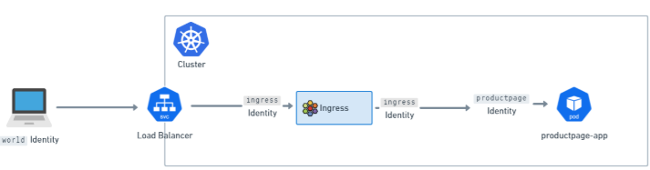

# What is Gateway API?
Gateway API is a Kubernetes SIG-Network subproject to design a successor for the Ingress object. It is a set of resources that model service networking in Kubernetes, and is designed to be role-oriented, portable, expressive, and extensible. See the [Gateway API](https://gateway-api.sigs.k8s.io/) site for more details.

# Cilium Gateway API Support
Cilium supports Gateway API v1.2.0 for below resources, all the Core conformance tests are passed.
- [GatewayClass](https://gateway-api.sigs.k8s.io/api-types/gatewayclass/)
- [Gateway](https://gateway-api.sigs.k8s.io/api-types/gateway/)
- [HTTPRoute](https://gateway-api.sigs.k8s.io/api-types/httproute/)
- [ReferenceGrant](https://gateway-api.sigs.k8s.io/api-types/referencegrant/)
- [GRPCRoute](https://gateway-api.sigs.k8s.io/api-types/grpcroutes)
- [TLSRoute (experimental)](https://gateway-api.sigs.k8s.io/references/spec/#gateway.networking.k8s.io%2fv1alpha2.TLSRoute/) 

# Prerequisites
- Cilium must be configured with NodePort enabled, using `nodePort.enabled=true` or by enabling the kube-proxy replacement with `kubeProxyReplacement=true`. For more information, see [kube-proxy replacement](https://docs.cilium.io/en/stable/network/kubernetes/kubeproxy-free/#kubeproxy-free).
- Cilium must be configured with the L7 proxy enabled using `l7Proxy=true` (enabled by default).
- The below CRDs from Gateway API v1.2.0 `must` be pre-installed. Please refer to this [docs](https://gateway-api.sigs.k8s.io/guides/?h=crds#getting-started-with-gateway-api) for installation steps. Alternatively, the below snippet could be used:
    - [GatewayClass](https://gateway-api.sigs.k8s.io/api-types/gatewayclass/)
    - [Gateway](https://gateway-api.sigs.k8s.io/api-types/gateway/)
    - [HTTPRoute](https://gateway-api.sigs.k8s.io/api-types/httproute/)
    - [ReferenceGrant](https://gateway-api.sigs.k8s.io/api-types/referencegrant/)
    - [GRPCRoute](https://gateway-api.sigs.k8s.io/api-types/grpcroutes)

- If you wish to use the TLSRoute functionality, you’ll also need to install the TLSRoute resource. If this CRD is not installed, then Cilium will disable TLSRoute support:
    - [TLSRoute (experimental)](https://gateway-api.sigs.k8s.io/references/spec/#gateway.networking.k8s.io%2fv1alpha2.TLSRoute/) 

You can install the required CRDs like this:

```bash
kubectl apply -f https://raw.githubusercontent.com/kubernetes-sigs/gateway-api/v1.2.0/config/crd/standard/gateway.networking.k8s.io_gatewayclasses.yaml
kubectl apply -f https://raw.githubusercontent.com/kubernetes-sigs/gateway-api/v1.2.0/config/crd/standard/gateway.networking.k8s.io_gateways.yaml
kubectl apply -f https://raw.githubusercontent.com/kubernetes-sigs/gateway-api/v1.2.0/config/crd/standard/gateway.networking.k8s.io_httproutes.yaml
kubectl apply -f https://raw.githubusercontent.com/kubernetes-sigs/gateway-api/v1.2.0/config/crd/standard/gateway.networking.k8s.io_referencegrants.yaml
kubectl apply -f https://raw.githubusercontent.com/kubernetes-sigs/gateway-api/v1.2.0/config/crd/standard/gateway.networking.k8s.io_grpcroutes.yaml
```

And add TLSRoute with this snippet.
```bash
kubectl apply -f https://raw.githubusercontent.com/kubernetes-sigs/gateway-api/v1.2.0/config/crd/experimental/gateway.networking.k8s.io_tlsroutes.yaml
```

- By default, the Ingress controller creates a Service of LoadBalancer type, so your environment will need to support this. Alternatively, you can change this to NodePort or, since Cilium 1.16+, directly expose the Cilium L7 proxy on the [host network](https://docs.cilium.io/en/stable/network/servicemesh/ingress/#gs-ingress-host-network-mode).

# Installation
Cilium Gateway API Controller can be enabled with helm flag `gatewayAPI.enabled` set as true. Please refer to [Installation using Helm](https://docs.cilium.io/en/stable/installation/k8s-install-helm/#k8s-install-helm) for a fresh installation.

```bash
helm upgrade cilium cilium/cilium --version 1.17.5 \
    --namespace kube-system \
    --reuse-values \
    --set kubeProxyReplacement=true \
    --set gatewayAPI.enabled=true
kubectl -n kube-system rollout restart deployment/cilium-operator
kubectl -n kube-system rollout restart ds/cilium
```

# How Cilium Ingress and Gateway API differ from other Ingress controllers

One of the biggest differences between Cilium’s Ingress and Gateway API support and other Ingress controllers is how closely tied the implementation is to the CNI. For Cilium, Ingress and Gateway API are part of the networking stack, and so behave in a different way to other Ingress or Gateway API controllers (even other Ingress or Gateway API controllers running in a Cilium cluster). Other Ingress or Gateway API controllers are generally installed as a Deployment or Daemonset in the cluster, and exposed via a Loadbalancer Service or similar (which Cilium can, of course, enable). Cilium’s Ingress and Gateway API config is exposed with a Loadbalancer or NodePort service, or optionally can be exposed on the Host network also. But in all of these cases, when traffic arrives at the Service’s port, eBPF code intercepts the traffic and transparently forwards it to Envoy (using the TPROXY kernel facility). This affects things like client IP visibility, which works differently for Cilium’s Ingress and Gateway API support to other Ingress controllers. It also allows Cilium’s Network Policy engine to apply CiliumNetworkPolicy to traffic bound for and traffic coming from an Ingress.

# Cilium’s ingress config and CiliumNetworkPolicy

Ingress and Gateway API traffic bound to backend services via Cilium passes through a per-node Envoy proxy. The per-node Envoy proxy has special code that allows it to interact with the eBPF policy engine, and do policy lookups on traffic. This allows Envoy to be a Network Policy enforcement point, both for Ingress (and Gateway API) traffic, and also for east-west traffic via GAMMA or L7 Traffic Management. However, for ingress config, there’s also an additional step. Traffic that arrives at Envoy for Ingress or Gateway API is assigned the special ingress identity in Cilium’s Policy engine. Traffic coming from outside the cluster is usually assigned the world identity (unless there are IP CIDR policies in the cluster). This means that there are actually two logical Policy enforcement points in Cilium Ingress - before traffic arrives at the ingress identity, and after, when it is about to exit the per-node Envoy.

    

This means that, when applying Network Policy to a cluster, it’s important to ensure that both steps are allowed, and that traffic is allowed from `world` to `ingress`, and from `ingress` to identities in the cluster (like the `productpage` identity in the image above).