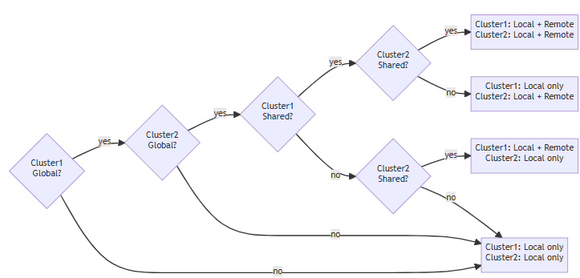
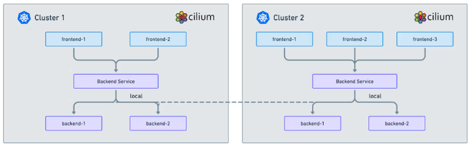
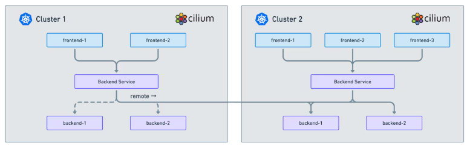

# Load-balancing with Global Services
Establishing load-balancing between clusters is achieved by defining a Kubernetes service with identical name and namespace in each cluster and adding the annotation `service.cilium.io/global: "true"` to declare it global. Cilium will automatically perform load-balancing to pods in both clusters.
```yaml
apiVersion: v1
kind: Service
metadata:
  name: rebel-base
  annotations:
    service.cilium.io/global: "true"
spec:
  type: ClusterIP
  ports:
  - port: 80
  selector:
    name: rebel-base
```

# Disabling Global Service Sharing
By default, a Global Service will load-balance across backends in multiple clusters. This implicitly configures `service.cilium.io/shared: "true"`. To prevent service backends from being shared to other clusters, this option should be disabled. Below example will expose remote endpoint without sharing local endpoints.
```yaml
apiVersion: v1
kind: Service
metadata:
  name: rebel-base
  annotations:
    service.cilium.io/global: "true"
    service.cilium.io/shared: "false"
spec:
  type: ClusterIP
  ports:
  - port: 80
  selector:
    name: rebel-base
```

# Global and Shared Services Reference
The flow chart below summarizes the overall behavior considering a service present in two clusters (i.e., Cluster1 and Cluster2), and different combinations of the `service.cilium.io/global` and `service.cilium.io/shared` annotation values. The terminating nodes represent the endpoints used in each combination by the two clusters for the service under examination.



# Limitations
- Global NodePort services load balance across both local and remote backends only if Cilium is configured to replace kube-proxy (either `kubeProxyReplacement=true` or `nodePort.enabled=true`). Otherwise, only local backends are eligible for load balancing when accessed through the NodePort.
- Global services accessed by a Node, or a Pod running in host network, load balance across both local and remote backends only if Cilium is configured to replace kube-proxy (`kubeProxyReplacement=true`). This limitation can be overcome enabling SocketLB in the host namespace: `socketLB.enabled=true`, `socketLB.hostNamespaceOnly=true`. Otherwise, only local backends are eligible for load balancing.

# Enabling Global Service Affinity
Load-balancing across multiple clusters might not be ideal in some cases. The annotation `service.cilium.io/affinity: "local|remote|none"` can be used to specify the preferred endpoint destination. For example, if the value of annotation `service.cilium.io/affinity` is `local`, the Global Service will load-balance across healthy local backends, and only user remote endpoints if and only if all of local backends are not available or unhealthy.
```yaml
apiVersion: v1
kind: Service
metadata:
  name: rebel-base
  annotations:
     service.cilium.io/global: "true"
     # Possible values:
     # - local
     #    preferred endpoints from local cluster if available
     # - remote
     #    preferred endpoints from remote cluster if available
     # none (default)
     #    no preference. Default behavior if this annotation does not exist
     service.cilium.io/affinity: "local"
spec:
  type: ClusterIP
  ports:
  - port: 80
  selector:
    name: rebel-base
```

## Local Service Affinity
Using the new Local Service Affinity annotation it is now possible to load balance traffic only to local endpoints unless the local endpoints aren’t available after which traffic will be sent to endpoints in remote clusters.



This feature optimizes connectivity for your applications and reduces cross-cluster traffic improving performance and reducing latency. Configuration of a Global Service in Cluster Mesh is done using the annotation `io.cilium/global-service=true`. The configuration of Local Service affinity is done using the annotation `io.cilium/service-affinity: local`. 
```yaml
apiVersion: v1
kind: Service
metadata:
  name: rebel-base
  annotations:
    io.cilium/global-service: "true"
    io.cilium/service-affinity: local
spec:
  type: ClusterIP
  ports:
  - port: 80
  selector:
    name: rebel-base
```

## Remote Service Affinity
Using the Remote Service Affinity feature, you can create a service that instead prefers load-balancing traffic to remote endpoints in other clusters. A common use case here is for operations where you need to temporarily forward traffic to remote clusters to be able to update or lifecycle application deployments in your local cluster and avoid any unavailability of your application. 



The configuration of Remote Service affinity is done by adding the annotation `io.cilium/service-affinity: remote` to a given Service.
```yaml
apiVersion: v1
kind: Service
metadata:
  name: rebel-base
  annotations:
    io.cilium/global-service: "true"
    io.cilium/service-affinity: remote
spec:
  type: ClusterIP
  ports:
  - port: 80
  selector:
    name: rebel-base
```

When configuring the annotation `io.cilium/service-affinity: none` there will be no service affinity and traffic will be load balanced to **all endpoints across clusters**.