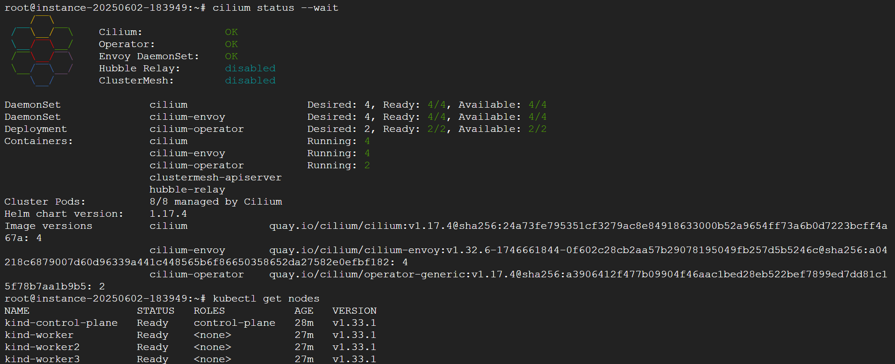

# Cilium Quick installation
This guide will walk you through the quick default installation. It will automatically detect and use the best configuration possible for the Kubernetes distribution you are using. All state is stored using Kubernetes custom resource definitions (CRDs). The docs focus primarily on the two most commonly used installation tools for Cilium: `cilium-cli` and `helm`. Helm is the popular Kubernetes package manager, while cilium-cli is a purpose-built tool to install and manage Cilium.

# Create Kubernetes cluster
If you don’t have a Kubernetes Cluster yet, you can use the instructions below to create a Kubernetes cluster locally or using a managed Kubernetes service:
1. kind
Install kind >= v0.7.0 per kind documentation: [Installation and Usage](https://kind.sigs.k8s.io/#installation-and-usage)
```bash
curl -LO https://raw.githubusercontent.com/cilium/cilium/1.17.5/Documentation/installation/kind-config.yaml
kind create cluster --config=kind-config.yaml
```
**Note** - Cilium may fail to deploy due to too many open files in one or more of the agent pods. If you notice this error, you can increase the `inotify` resource limits on your host machine (see Pod errors due to “[too many open files](https://kind.sigs.k8s.io/docs/user/known-issues/#pod-errors-due-to-too-many-open-files”).

2. GKE
The following commands create a Kubernetes cluster using Google Kubernetes Engine. See [Installing Google Cloud SDK](https://cloud.google.com/sdk/install) for instructions on how to install gcloud and prepare your account.
```shell
export NAME="$(whoami)-$RANDOM"
# Create the node pool with the following taint to guarantee that
# Pods are only scheduled/executed in the node when Cilium is ready.
# Alternatively, see the note below.
gcloud container clusters create "${NAME}" \
 --node-taints node.cilium.io/agent-not-ready=true:NoExecute \
 --zone us-west2-a
gcloud container clusters get-credentials "${NAME}" --zone us-west2-a
```

# Install the Cilium CLI
Install the latest version of the Cilium CLI. The Cilium CLI can be used to install Cilium, inspect the state of a Cilium installation, and enable/disable various features (e.g. clustermesh, Hubble).
```shell
CILIUM_CLI_VERSION=$(curl -s https://raw.githubusercontent.com/cilium/cilium-cli/main/stable.txt)
CLI_ARCH=amd64
if [ "$(uname -m)" = "aarch64" ]; then CLI_ARCH=arm64; fi
curl -L --fail --remote-name-all https://github.com/cilium/cilium-cli/releases/download/${CILIUM_CLI_VERSION}/cilium-linux-${CLI_ARCH}.tar.gz{,.sha256sum}
sha256sum --check cilium-linux-${CLI_ARCH}.tar.gz.sha256sum
sudo tar xzvfC cilium-linux-${CLI_ARCH}.tar.gz /usr/local/bin
rm cilium-linux-${CLI_ARCH}.tar.gz{,.sha256sum}
```

# Install Cilium
You can install Cilium on any Kubernetes cluster. I would recommend most first-time users to install Cilium with the cilium-cli tool and its command cilium install. It would install the latest stable release by default:
```shell
cilium install
```
Some configuration options can be specified with cilium install. For example, cilium install --encryption wireguard can be used to enable transparent encryption with WireGuard. But if you want to fully customize your installation, you should use cilium-cli with helm-set (to specify configuration values on the command line based on Helm values) or helm-values to pull these values out of a YAML file. For example, this is what we use to install Cilium with BGP enabled in our BGP lab:
```shell
cilium install 
    --helm-set ipam.mode=kubernetes 
    --helm-set tunnel=disabled 
    --helm-set ipv4NativeRoutingCIDR="10.0.0.0/8" 
    --helm-set bgpControlPlane.enabled=true 
    --helm-set k8s.requireIPv4PodCIDR=true
```
If the installation fails for some reason, run `cilium status` to retrieve the overall status of the Cilium deployment and inspect the logs of whatever pods are failing to be deployed. 

# Validate the installation
To validate that Cilium has been properly installed, you can run
```shell
cilium status --wait
```


Run the following command to validate that your cluster has proper network connectivity:
```shell
cilium connectivity test
ℹ️  Monitor aggregation detected, will skip some flow validation steps
✨ [k8s-cluster] Creating namespace for connectivity check...
(...)
---------------------------------------------------------------------------------------------------------------------
📋 Test Report
---------------------------------------------------------------------------------------------------------------------
✅ 69/69 tests successful (0 warnings)

```