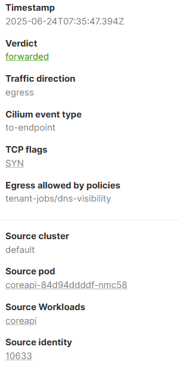
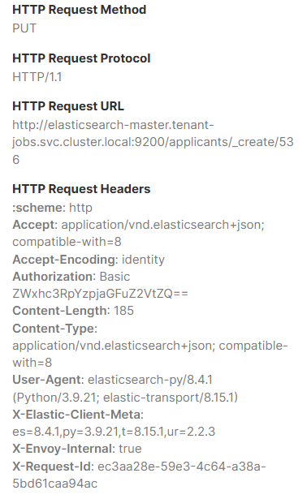

# Kind Cluster
We are running a Kind Kubernetes cluster, and on top of that Cilium. While the Kind cluster is finishing the startup, let's have a look at its configuration:
```yml
# yq /etc/kind/${KIND_CONFIG}.yaml
---
kind: Cluster
apiVersion: kind.x-k8s.io/v1alpha4
nodes:
  - role: control-plane
    extraPortMappings:
      # localhost.run proxy
      - containerPort: 32042
        hostPort: 32042
      # Hubble relay
      - containerPort: 31234
        hostPort: 31234
      # Hubble UI
      - containerPort: 31235
        hostPort: 31235
  - role: worker
  - role: worker
networking:
  disableDefaultCNI: true
  kubeProxyMode: none
```

# Nodes
In the `nodes` section, you can see that the cluster consists of two nodes:
- 1 `control-plane` node running the Kubernetes control plane and etcd
- 2 `worker` nodes to deploy the applications
We are exposing ports on the control plane node so we can access them from the work machine:
- port `31234`, used to access Hubble Relay (from the CLI)
- port `31235`, used to access the Hubble UI
Note that since the standard port for Hubble Relay is `4245`, we have exported the `HUBBLE_SERVER` variable in the current shell to use the `31234` port instead. Verify its value with the following command:
```shell
echo $HUBBLE_SERVER # localhost:31234
```

# Networking
n the networking section of the configuration file, the default CNI has been disabled so the cluster won't have any Pod network when it starts. Instead, Cilium is being deployed to the cluster to provide this functionality. To see if the Kind cluster is ready, verify that the cluster is properly running by listing its nodes:
```shell
kubectl get nodes
```
You should see the three nodes appear. If not, the worker nodes might still be joining the cluster, this process typically takes 60 seconds, to check on the progress you can re-run the command until you see the second node kind-worker. Once we have a working Kind cluster, let's move on to deploy a sample application on it!

# Deploying demo application
Let's start by deploying a simple demo application that we can use to explore the Isovalent Enterprise for Cilium connectivity observability capabilities such as network flows and inspecting DNS and HTTP traffic.
```shell
helm upgrade jobs-app ./helm/jobs-app.tgz \
	--install \
	--namespace tenant-jobs --create-namespace \
	--values ./helm/jobs-app-values.yaml
```
This application installs into the "tenant-jobs" namespace and is made up of 11 services which emulate a job application website. To imitate human interaction, one of the services, called crawler, is included which accesses and pushes files, mimicking a user uploading their CV. Throughout this lab, we will delve into the intricacies of the application's microservices and examine the traffic flows between them. Additionally, we will analyze the influence of network policies on these flows and explore how Hubble Enterprise integrates all this data, providing a seamless and user-friendly troubleshooting experience.

# Cilium and Hubble status
While the application is starting, let's check if all Cilium components have been properly deployed. Note that it might take a few seconds to display the results!
```shell
cilium status --wait
```
If all is well, we should see that the lines "Cilium", "Operator" and "Hubble Relay" show as OK. Some services might not be available yet. You can wait a bit and try again with the above command.
```shell
    /¯¯\
 /¯¯\__/¯¯\    Cilium:             OK
 \__/¯¯\__/    Operator:           OK
 /¯¯\__/¯¯\    Envoy DaemonSet:    OK
 \__/¯¯\__/    Hubble Relay:       OK
    \__/       ClusterMesh:        disabled
```
You can also verify that you can properly connect to Hubble relay (using port `31234` in our lab) with:
```shell
hubble status
```
and that all nodes are properly managed in Hubble:
```shell
hubble list nodes
```

# Observing Flows
The `hubble` CLI connects to the Hubble Relay component in the cluster and retrieves logs called "Flows". This command-line tool provides the ability to easily visualize and filter the network flows, significantly enhancing your Kubernetes network troubleshooting capabilities. For example, you can see the latest flows linked to the `tenant-jobs` namespace with:
```shell
hubble observe --namespace tenant-jobs
```
You will see a list of logs, each with:
- a timestamp (e.g `Jun 24 07:19:39.804`)
- a source pod, along with its namespace, port, and Cilium identity
    - `tenant-jobs/strimzi-cluster-operator-699cd75b77-42464:58520 (ID:12103)`
- the direction of the flow (`->`, `<-`, or at times `<>` if the direction could not be determined)
- a destination pod, along with its namespace, port, and Cilium identity
    - `kube-system/coredns-6f6b679f8f-wbdpm:53 (ID:26378)`
- a trace observation point (e.g. `to-endpoint`, `to-stack`, `to-overlay`)
- a verdict (e.g. `FORWARDED` or `DROPPED`)
- a protocol (e.g. `UDP`, `TCP`), optionally with flags

# The Hubble UI
Let's now have a look at the Hubble UI by clicking on the Hubble UI tab (it might take a few seconds to load). This Hubble UI provides the same type of information as a CLI, also gathered from Hubble Relay. In the left-hand menu, select "Connections", then pick the `tenant-jobs` namespace from the list. Once the namespace is selected, you should see a service map. 


The service map tab will show both a map and flow-list view of data on a per-namespace basis. Each box represents a service, which is one or more pods with the same set of identity-relevant Kubernetes labels. Thus, the service map remains simple even if a service has many replicas, or the underlying pods have been created and destroyed.

By default, Hubble observability data operates only at the L3/L4 layer (i.e., TCP/UDP) but not at the L7 layer (i.e., application protocols like HTTP). In this track, we will start out showing only L3/L4 visibility, and then demonstrate how to add DNS and HTTP visibility. 

# Flows
In the Hubble UI tab, you should be presented with the Hubble Enterprise UI, displaying the Service Map page for the tenant-jobs namespace. At the bottom of the page you should see a flows table:


By default, the flows table shows an aggregated list of flows. Flows are aggregated by source identity, source IP address, destination identity, destination IP address, destination protocol and destination port. This makes the flows table easier to read. Try unchecking the "Aggregate flows" box in the left column and observe the result. You will see many more rows in the flows, as every flow gets its own row.


Check the aggregation box again. Traditional packet-based network monitoring tools are limited in their ability to understand cloud native environments like Kubernetes, because they rely on IP addresses, which are ephemeral in a cloud native environment and thus meaningless for security monitoring and incident investigation. Using the Hubble user interface, you can see the flows between services represented by their logical, long-lasting identities instead of their IP addresses.


The flows view can however display IP addresses as well. Try clicking the "Columns" selector on top of the flows table and display the source and destination IP addresses. By clicking a specific flow, you can see more details on this log. Check for example the "crawler to loader" flow:


Service Map and Flows are very useful, but the current demo currently doesn't allow to see which external DNS names are accessed. In the next challenge, we will activate DNS visibility in this view!

# DNS Visibility Network Policy
Notice in the the Hubble UI Service Map that the crawler identity makes HTTPS (443/TCP) requests to the world identity, but there's no way to know which actual DNS names are used. You can also see this using Hubble CLI, switch to the terminal tab and run the following command.
```shell
hubble observe -n tenant-jobs --from-label=app=crawler
```
You will see output similar to the below:
```shell
Jun 24 07:31:01.556: tenant-jobs/crawler-657d8d487f-z2zlv:38292 (ID:15928) -> 140.82.121.5:80 (world) to-stack FORWARDED (TCP Flags: SYN)
```
In order to inspect the DNS lookups for pods within a namespace, we must apply a network policy that tells Cilium to inspect port 53 traffic from pods to Kube-DNS at Layer 7. To apply such a policy for the tenant-jobs namespace, click on the terminal tab. Let us first verify that we get the same type of information using the Hubble CLI, which will return nothing, this is the expected behaviour:
```shell
hubble observe --namespace tenant-jobs --protocol dns
```
Now apply the following command:
```shell
kubectl -n tenant-jobs apply -f https://docs.isovalent.com/public/dns-visibility.yaml
```
While this is a network policy, it is a policy that will allow all connectivity in the environment, so no traffic is dropped as a result of this policy. This simple visibility policy works for this scenario when we are not trying to implement a zero-trust networking policy. However, this `dns-visibility.yaml` policy should not be used in combination with other egress network policies as it will allow all egress connectivity. You can view this policy's spec with the command:
```yml
# kubectl get cnp dns-visibility -n tenant-jobs -o yaml | yq .spec
egress:
  - toEntities:
      - all
  - toEndpoints:
      - matchLabels:
          k8s:io.kubernetes.pod.namespace: kube-system
          k8s:k8s-app: kube-dns
    toPorts:
      - ports:
          - port: "53"
            protocol: ANY
        rules:
          dns:
            - matchPattern: '*'
endpointSelector:
  matchLabels: {}
```
In this policy we can see the following configuration:
- `egress` is a list of Egress rules which are enforced at egress
- `toEntities` is used to describe the entities that can be accessed by the selected endpoints
- `toEndpoints` a selector inside the rule specifies which endpoints with Kubernetes labels the traffic can be sent to.
- `toPorts` specifies an Layer 4 port with an optional transport protocol that traffic can be sent to.
- `rules` configures the DNS proxy at Layer 7 to capture all FQDN DNS requests
- `endpointSelector` selects all endpoints which should be subject the rules defined in this policy. `{}` is the default to apply to all.
Let's verify that we can now visualize DNS requests in Hubble:
```shell
hubble observe --namespace tenant-jobs --protocol dns
```
You should now see logs for DNS requests in the tenant-jobs namespace. You can then filter flows using DNS names, for example:
```shell
hubble observe --to-fqdn api.github.com
```

# HTTP Visibility Network Policy
In the Flows table, click on a the flow which corresponds to a communication from coreapi to elasticsearch-master. You will see a "Flow Details" popup on the right side of the table:



Scroll down within the "Flow Details" popup to view all the information in this table. Currently, we notice that there are no HTTP fields available, which limits our visibility into the HTTP-related aspects of this communication. To rectify this and enable HTTP visibility, we will apply a NetworkPolicy. This will allow us to gather more detailed information about the HTTP traffic within this communication flow. Switch to the terminal tab. First, we can also verify using the Hubble CLI that we are not collecting any HTTP visibility details, this command will return nothing:
```shell
hubble observe --namespace tenant-jobs --protocol http
```
Now apply the following command:
```shell
kubectl -n tenant-jobs apply -f https://docs.isovalent.com/public/http-ingress-visibility.yaml
```
You can view this policy's spec with the command:
```yml
# kubectl get cnp http-ingress-visibility -n tenant-jobs -o yaml | yq .spec
endpointSelector:
  matchLabels: {}
ingress:
  - fromEntities:
      - all
  - toPorts:
      - ports:
          - port: "80"
            protocol: TCP
          - port: "8080"
            protocol: TCP
          - port: "9080"
            protocol: TCP
          - port: "50051"
            protocol: TCP
          - port: "9200"
            protocol: TCP
        rules:
          http:
            - {}
```
In this policy, we are again applying the policy to all endpoints using the `endpointSelector` field, against all `ingress` traffic coming all `fromEntities` regardless if they are internal or external to the cluster. We have specified a number of `toPorts` to capture the incoming traffic, with the `rule` specifying this applies to all `http` traffic.

List the HTTP flows again:
```shell
hubble observe --namespace tenant-jobs --protocol http
```
You can see in the last part of the flows the details of the HTTP request, for example:
```shell
HTTP/1.1 POST http://coreapi:9080/applicants
```
Using the Hubble CLI, you can now filter on HTTP method and path. Try for example:
```shell
hubble observe --namespace tenant-jobs --http-path /applicants
# and
hubble observe --namespace tenant-jobs --http-method POST
```
Filters can be combined, too, the below example filters for flows of HTTP requests any pod with the label "app=core-api", where the HTTP path is "/applicants" and the HTTP method is "PUT"
```shell
hubble observe --namespace tenant-jobs \
  --from-label 'app=coreapi' --protocol http \
  --http-path /applicants --http-method PUT
```
You can see the output example below:
```shell
Jun 24 07:42:25.760: tenant-jobs/coreapi-84d94ddddf-nmc58:48694 (ID:10633) -> tenant-jobs/elasticsearch-master-0:9200 (ID:33645) http-request FORWARDED (HTTP/1.1 PUT http://elasticsearch-master.tenant-jobs.svc.cluster.local:9200/applicants/_create/508)
```
Click on the new row that appears at the top of the table for the coreapi to elasticsearch-master flow. Scroll down the flow details. You should see HTTP details for this flow:

