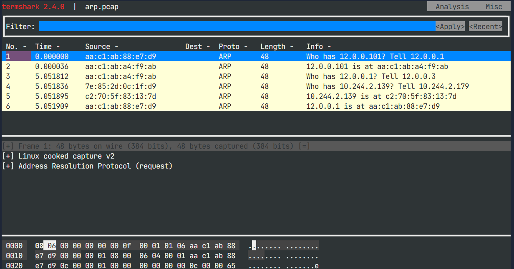

# Cilium North-South Load Balancer
Cilium provides two ways to create North-South Load Balancer services in the cluster and announce them to the underlying networking, using either BGP or ARP. In this lab, we will see how to announce the services without the use of BGP, by leveraging L2 (ARP). However, not everyone with an on-premise Kubernetes cluster has a BGP-compatible infrastructure. For this reason, Cilium now allows to use ARP in order to announce service IP addresses on Layer 2.


# Kind Cluster
We are going to be using Kind to set up our Kubernetes cluster, and on top of that Cilium. Let's have a look at its configuration:
```yml
# yq cluster.yaml
kind: Cluster
apiVersion: kind.x-k8s.io/v1alpha4
networking:
  disableDefaultCNI: true
  kubeProxyMode: "none"
nodes:
  - role: control-plane
    extraPortMappings:
      # Hubble relay
      - containerPort: 31234
        hostPort: 31234
      # Hubble UI
      - containerPort: 31235
        hostPort: 31235
  - role: worker
  - role: worker
```
In the `nodes` section, you can see that the cluster consists of three nodes:
- 1 `control-plane` node running the Kubernetes control plane and etcd
- 2 `worker` nodes to deploy the applications

# Install Cilium
Let's install Cilium on the cluster. We will use Cilium CLI and pass specific options to the Helm chart using `--set` flags. In particular, the following Helm values need to be used in order to configure the L2 announcements:
```yml
kubeProxyReplacement: true
l2announcements:
  enabled: true
devices: {eth0, net0}
externalIPs:
  enabled: true
```
Install Cilium:
```bash
cilium install \
  --version v1.17.1 \
  --set kubeProxyReplacement=true \
  --set k8sServiceHost="kind-control-plane" \
  --set k8sServicePort=6443 \
  --set l2announcements.enabled=true \
  --set l2announcements.leaseDuration="3s" \
  --set l2announcements.leaseRenewDeadline="1s" \
  --set l2announcements.leaseRetryPeriod="500ms" \
  --set devices="{eth0,net0}" \
  --set externalIPs.enabled=true \
  --set operator.replicas=2
```
Enable Hubble for visualization:
```shell
cilium hubble enable --ui
```
Check that Cilium is running correctly:
```shell
cilium status --wait
```
You can also check the L2 Announcements setting with:
```shell
cilium config view | grep l2
```
In the next challenge, we will deploy a first L2 Announcement Policy!

# Deploy a workload and service
Let's deploy a Death Star workload and corresponding service:
```shell
kubectl apply -f deathstar.yaml
```
This deploys two deathstar pods and a service of type ClusterIP pointing to them. Wait for the Death Star deployment to be ready:
```shell
kubectl rollout status deployment deathstar
```
Inspect the service:
```shell
kubectl get svc deathstar --show-labels
```
We'd like to access the Death Star from the outside of the cluster. In order to do this, we can add an external IP to the service. For now, let's set an IP address manually on it. We will use 12.0.0.100 as the external IP address:
```shell
SVC_IP=12.0.0.100
kubectl patch service deathstar -p '{"spec":{"externalIPs":["'$SVC_IP'"]}}'
```
Verify that the service has the correct external IP now:
```shell
kubectl get svc deathstar
```

# Access the service
A docker container called `clab-garp-demo-neighbor` has been deployed in the same network as the IP assigned to the service. Execute a shell in it:
```shell
docker exec -e SVC_IP=$SVC_IP -ti clab-garp-demo-neighbor bash
```
Try to access the newly created service:
```shell
curl --connect-timeout 1 http://$SVC_IP/v1/
```
The connection times out because this service is not advertised via ARP yet, so the container doesn't know how to reach it.

# Deploy an L2 Announcement Policy
Cilium L2 Announcement Policy resources tell Cilium which services need to be announced using ARP. For this challenge, we provide an L2 Announcement Policy for Cilium. Switch to the second terminal and inspect the policy:
```yml
# yq l2policy.yaml
apiVersion: "cilium.io/v2alpha1"
kind: CiliumL2AnnouncementPolicy
metadata:
  name: policy1
spec:
  externalIPs: true
  loadBalancerIPs: false
  interfaces:
    - net0
  serviceSelector:
    matchLabels:
      color: blue
  nodeSelector:
    matchExpressions:
      - key: node-role.kubernetes.io/control-plane
        operator: DoesNotExist
```
You can see that it will announce external IPs (but not load balancer IPs) on the net0 interface on nodes, and it applies to services with a label color=blue. We've also added a nodeSelector entry to avoid using the Control Plane node as an entry point for the load balancer. Apply the policy:
```shell
kubectl apply -f l2policy.yaml
```
Switch back to the first terminal and try to access the service again:
```shell
curl --connect-timeout 1 http://$SVC_IP/v1/
```
The connection still times out, because the L2 policy applies to services labeled `color=blue`, but the Death Star service is currently labeled with `color=red`.

# Announce the service
Switch to the second terminal tab and modify the service to use a `color=blue` label:
```shell
kubectl label svc deathstar color=blue --overwrite
```
Now go back to the container in the first terminal and try to connect again:
```shell
curl --connect-timeout 1 http://$SVC_IP/v1/
```
The service can now be accessed as the IP was announced via ARP to the network!

# Visualize ARP traffic
What just happened? Let's visualize the traffic on the node that hosts the leases! Let's deploy a new service called deathstar-2 which points to the same Death Star service:
```shell
kubectl apply -f deathstar-2.yaml
```
This service already has a pre-defined static external IP of 12.0.0.101 and is labeled with color=blue, so it will be advertised by the policy1 L2 Announcement Policy we previously deployed. Verify the service:
```shell
kubectl get svc deathstar-2
```

# Prepare the visualization
Under the hood, Cilium creates a `Lease` resource in the `kube-system` namespace for each L2 lease associated with a service. View the lease for the `deathstar-2` service with:
```shell
kubectl get leases -n kube-system cilium-l2announce-default-deathstar-2 -o yaml
```
The node hosting the lease is specified in spec.holderIdentity. Retrieve it:
```shell
LEASE_NODE=$(kubectl -n kube-system get leases cilium-l2announce-default-deathstar-2 -o jsonpath='{.spec.holderIdentity}')
echo $LEASE_NODE    # kind-worker
```
Next, find the Cilium agent pod running on that node:
```shell
LEASE_CILIUM_POD=$(kubectl -n kube-system get pod -l k8s-app=cilium --field-selector spec.nodeName=$LEASE_NODE -o name)
echo $LEASE_CILIUM_POD      # cilium-wdgr5
```
Now, log into the CIlium agent pod:
```shell
kubectl -n kube-system exec -ti $LEASE_CILIUM_POD -- bash
```
Install tcpdump and termshark in the pod:
```shell
apt-get update && DEBIAN_FRONTEND=noninteractive apt-get -y install tcpdump termshark
```
Launch `tcpdump` in the background in the pod. Filter on ARP packets and write the flows in the `arp.pcap` file:
```shell
tcpdump -i any arp -w arp.pcap
```

# Make another request
Now go to the second terminal tab and make a request to the service:
```shell
docker exec -ti clab-garp-demo-neighbor \
  curl --connect-timeout 1 http://12.0.0.101/v1/
```
Now switch back to the first terminal tab and kill tcpdump with `Ctrl+C`. Prepare termshark to use a dark theme:
```shell
mkdir -p /root/.config/termshark/
echo -e "[main]\ndark-mode = true" > /root/.config/termshark/termshark.toml
```
Launch termshark in the pod to visualize the ARP traffic captured by tcpdump:
```shell
TERM=xterm-256color termshark -r arp.pcap
```
Should see the ARP request and response for 12.0.0.101:


In the next challenge, we will see how to use the LB IPAM to automatically assign external IPs to services announced via ARP.

# Automatic IPAM
To allocate IP addresses for Kubernetes Services that are exposed outside of a cluster, you need a resource of the type LoadBalancer. When you use Kubernetes on a cloud provider, these resources are automatically managed for you and their IP and/or DNS are automatically allocated. However if you run on a bare-metal cluster, you need another tool to allocate that address as Kubernetes doesn't natively support this function. Typically you would have to install and use something like MetalLB for this purpose. Maintaining yet another networking tool can be cumbersome. In Cilium 1.13, you no longer need MetalLB for this use case: Cilium can allocate IP Addresses to Kubernetes LoadBalancer Service. Let's have a look at this feature in more details.

# Create an IPAM Pool
In Cilium, the Load-Balancer IP Address Management (LB-IPAM) feature is enabled by default but dormant until the first IP Pool is added to the cluster. In order to assign IPs to services, let's create an IPAM Pool called `pool-blue` for our `color=blue` services. Check its definition:
```yml
# yq pool-blue.yaml
apiVersion: "cilium.io/v2alpha1"
kind: CiliumLoadBalancerIPPool
metadata:
  name: "pool-blue"
spec:
  blocks:
    - cidr: "12.0.0.128/25"
  serviceSelector:
    matchLabels:
      color: blue
```
With this policy applied, IP addresses from the `12.0.0.128/25` range will be assigned to LoadBalancer services that match the `color=blue` label selector. Apply the manifest:
```shell
kubectl apply -f pool-blue.yaml
```

# Enable Load Balancers in L2 Announcement Policy
Do you remember when we added the L2 Announcement Policy? We made a note that it would only announce external IPs but not load balancer IPs. Let's modify the policy to also accounce load balancer IPs!

Switch to the Editor tab, edit the `l2policy.yaml` file, and set `spec.loadBalancerIPs` to true. Then update the resource in first terminal:
```shell
kubectl apply -f l2policy.yaml
```

# Create a new service
Let's create a new service for the Death Star pods called `deathstar-3`, without a static IP assigned to it:
```shell
kubectl expose deployment deathstar --name deathstar-3 --port 80 --type LoadBalancer
```
Check the service:
```shell
kubectl get svc deathstar-3 --show-labels
```
It currently doesn't have an external IP, because it doesn't have a label matching an IPAM pool at the moment. Add the `color=blue` label to the service:
```shell
kubectl label svc deathstar-3 color=blue
```
Check the service again:
```shell
kubectl get svc deathstar-3 --show-labels
```
It has now received an external IP in the range associated with the blue IPAM pool. Since `color: blue` also corresponds with the L2 Announcement Policy we deployed earlier, this service should already be available via ARP. Let's check it:
```shell
SVC2_IP=$(kubectl get svc deathstar-3 -o jsonpath='{.status.loadBalancer.ingress[0].ip}')
echo $SVC2_IP
docker exec -ti clab-garp-demo-neighbor curl --connect-timeout 1 $SVC2_IP/v1/
```
In the next challenge, we will test the resilience of the L2 announcements.

# Load Balancer resiliences
Let's start by monitoring the ARP responses for the service IP.
In the first terminal, retrieve the service IP once again, arping it and check the ARP responses for it in the Docker container.
```shell
docker exec -ti clab-garp-demo-neighbor arping 12.0.0.100
```
Leave this command running. Note the MAC address that is returned by arping.

# Remove the node
Let's identify which node is currently bearing the IP for the service. Kubernetes provides a `Leases` resource type for each service, which contains that information. That resource is stored in the `kube-system` namespace, and has a name in the format `cilium-l2announce-<namespace>-<service>`. Since our service is called deathstar in the default namespace, we need to look for `cilium-l2announce-default-deathstar`. Move to the second terminal tab and look at the lease resource's spec:
```shell
kubectl -n kube-system get leases cilium-l2announce-default-deathstar -o yaml | yq .spec
```
The resource has a `spec.holderIdentity` field, which indicates that the node currently holding the lease is `kind-worker`. Since our nodes are Docker containers, removing a node will not fully take down the datapath as the veth pair for it will stay behind. So in order to simulate a node removal, we'll need to identify the veth pair so we can take down the interface on the node. First, retrieve the MAC address for the lease. As we saw, we can get that information by resolving the IP with ARP:
```shell
docker exec -ti clab-garp-demo-neighbor arp 12.0.0.100
```
Next, let's get the veth pair number from the node:
```shell
docker exec kind-worker ip a | grep -B1 aa:c1:ab:a4:f9:ab
```
Finally, retrieve the interface name on the VM for that veth pair:
```shell
ip a | grep if15
```
Now, let's simulate a problem on the node by removing the Docker container that hosts it:
```shell
docker kill kind-worker
```
And remove the veth interface:
```shell
ip link set net2 down
```
Check the lease again:
```shell
kubectl -n kube-system get leases cilium-l2announce-default-deathstar -o yaml | yq .spec.holderIdentity
```
The holder identity should have changed to `kind-worker2`. If it hasn't, launch the command a second time.

# Check the fallback
Move back to the first terminal tab. After a few timeouts, the arping command should now resolve to a different MAC address, showing that the load balancer lease has been moved to another node:
```log
58 bytes from aa:c1:ab:a4:f9:ab (12.0.0.100): index=212 time=6.894 usec
58 bytes from aa:c1:ab:a4:f9:ab (12.0.0.100): index=213 time=4.859 usec
58 bytes from aa:c1:ab:a4:f9:ab (12.0.0.100): index=214 time=4.984 usec
Timeout
Timeout
Timeout
58 bytes from aa:c1:ab:dd:35:be (12.0.0.100): index=215 time=5.786 usec
58 bytes from aa:c1:ab:dd:35:be (12.0.0.100): index=216 time=5.325 usec
58 bytes from aa:c1:ab:dd:35:be (12.0.0.100): index=217 time=4.779 usec
58 bytes from aa:c1:ab:dd:35:be (12.0.0.100): index=218 time=5.761 usec
```
In fact, if the transition was fast enough, you might not even seen a timeout at all! Move back to the second terminal and try to access the service again:
```shell
docker exec -ti clab-garp-demo-neighbor curl 12.0.0.100/v1/
```
It should work fine.

# Configuring Leases
Leases can be configured in Cilium. In this lab, we configured the Helm chart with the following values:
```yml
l2announcements:
  enabled: true
  leaseDuration: 3s
  leaseRenewDeadline: 1s
  leaseRetryPeriod: 500ms
```
Check the values in the Cilium configuration with:
```shell
cilium config view | grep l2-announcements
```
Success!